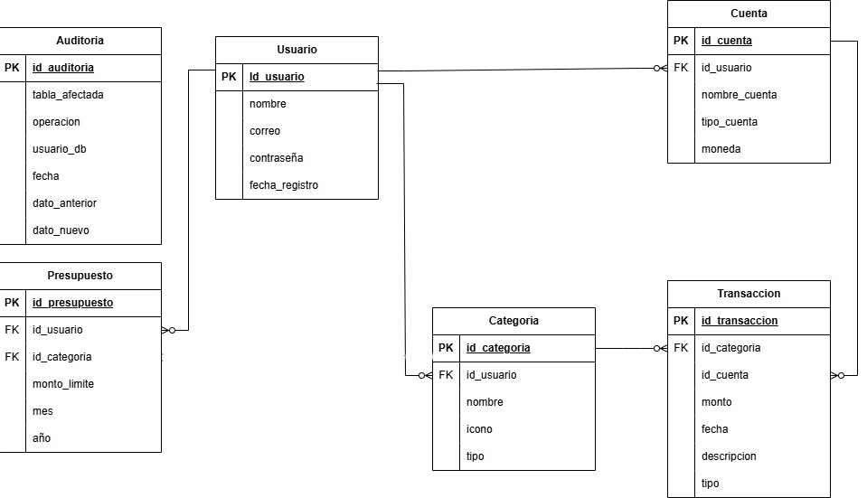
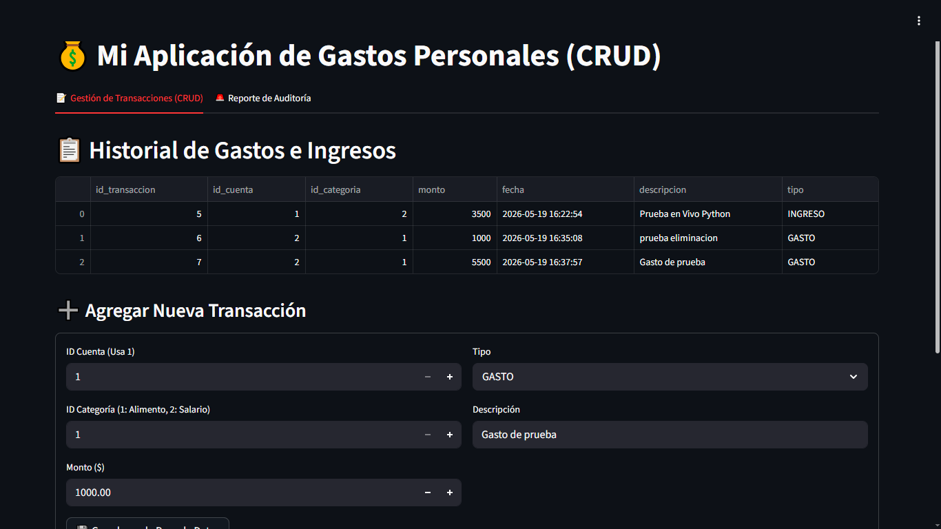
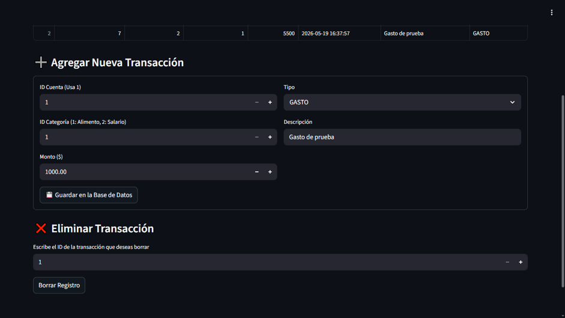
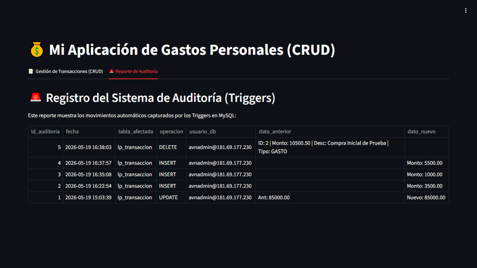

# Personal Finance Management System

## Overview

This project is a personal finance management system developed using Python, Streamlit, and MySQL.

The application allows users to manage accounts, income and expense transactions while maintaining data integrity through a normalized relational database design and automated audit logging.

The project was developed as part of a university Database Systems course and focuses on relational modeling, SQL implementation, database auditing, and cloud deployment.

---

## Features

- User management
- Account management
- Income and expense tracking
- Relational database design (3NF)
- MySQL cloud deployment
- Automated audit logging using triggers
- Transaction history management
- CRUD operations through a Streamlit interface

---

## Technologies Used

### Backend

- Python
- Streamlit

### Database

- MySQL
- SQL
- Triggers
- Foreign Keys
- Referential Integrity

### Cloud Infrastructure

- Aiven for MySQL

---

## Database Design

The relational model follows Third Normal Form (3NF) principles to reduce redundancy and ensure consistency.

### Main Entities

- Users
- Accounts
- Categories
- Transactions
- Budgets
- Audit Log

### Entity Relationship Diagram



The database structure was designed using relational modeling principles and includes integrity constraints, foreign keys, and an auditing subsystem implemented through SQL triggers.

---

## Audit System

A database-level auditing mechanism was implemented using MySQL triggers.

The audit system automatically records:

- Insert operations
- Update operations
- Delete operations
- User information
- Previous values
- New values
- Timestamp of each event

This approach ensures traceability and improves data integrity.

---

## Application Screenshots

### Main Dashboard



### Transaction Management Interface



### Audit Log Report



---

## Project Structure

```text
personal-finance-management-system
│
├── app/
│   └── Streamlit application
│
├── database/
│   ├── Backup_Total_Proyecto.sql
│   └── Triggers.sql
│
├── images/
│   ├── Principal.png
│   ├── principal2.png
│   ├── audit.png
│   └── entity_relationship_diagram.png
│
└── README.md
```

---

## Learning Outcomes

This project strengthened skills in:

- Relational database modeling
- SQL development
- Trigger implementation
- Database auditing
- Cloud database deployment
- Python application development
- Data integrity and security concepts

---

## Future Improvements

- User authentication
- Budget planning module
- Interactive dashboards
- Financial analytics
- Data visualization tools
- Exportable reports

---

## Database Deployment

The original project was deployed using a cloud-hosted MySQL instance on Aiven.

Since the free-tier instance is no longer active, the repository includes:

- Complete database schema
- Trigger definitions
- Sample data scripts

allowing the database to be recreated locally in any MySQL environment.

---

## Author

**Jacobo Lopez**

Mathematics Undergraduate Student

Fundación Universitaria Konrad Lorenz

Colombia
